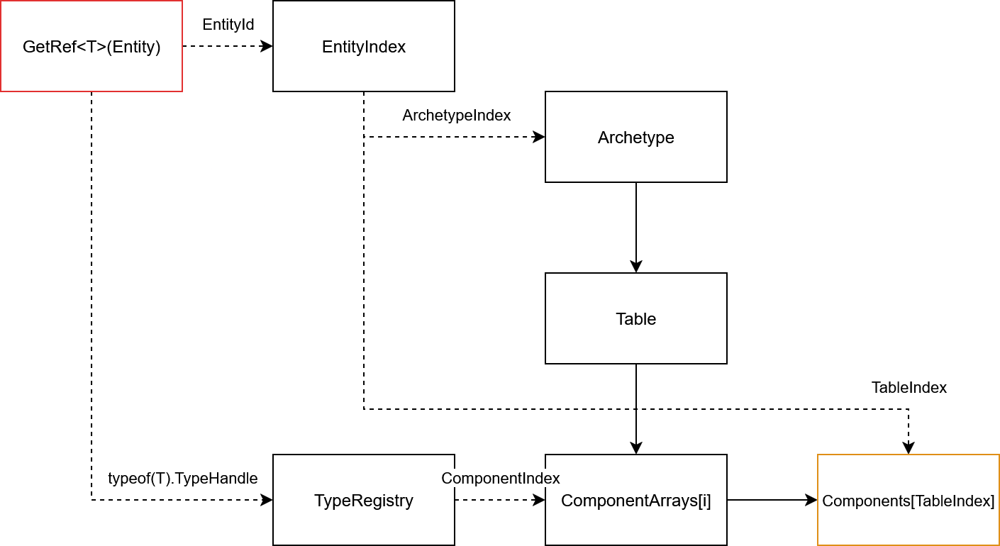
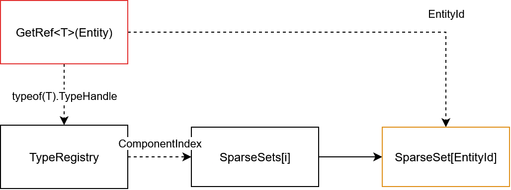

# Component stores

## Archetype
* Archetypes store entities which possess the same set of components and tags.
* Every component attached to an entity is stored in one of the following component stores.

## Table
A table holds a set of components in a dense array. <br/>
The index stored in the archetype corresponds with the index of the table.



## Sparse Set
A sparse set holds a set of components in a sparse array(or hashmap) <br/>
The entity value corresponds with the index in the sparse set.



## External


External component stores can customize how component data is stored, in order to do so, they must implement the following interface.
```cs
interface IExternalComponentStore<T>
{ 
    void Add(EcsHandle handle, T val);
    void Remove(EcsHandle handle);
    ref T GetRef(EcsHandle handle);
}
```
